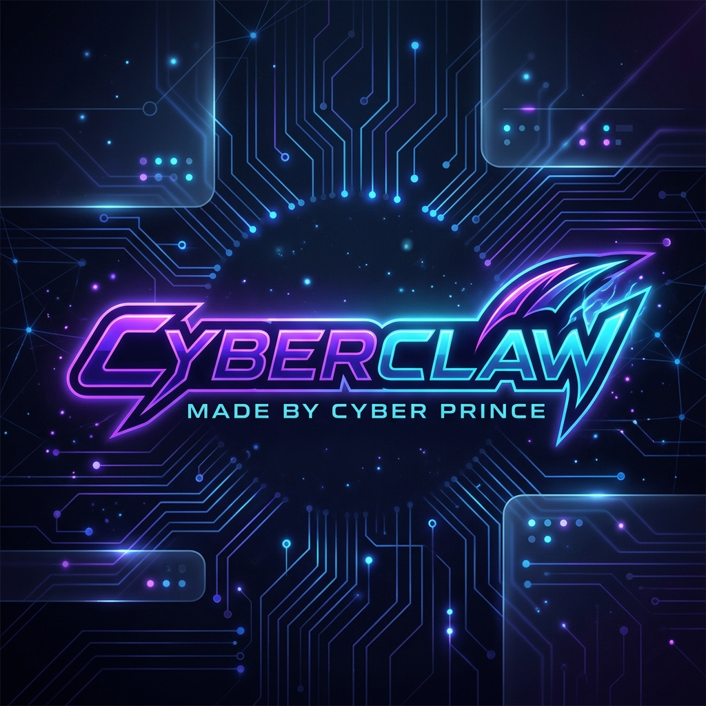
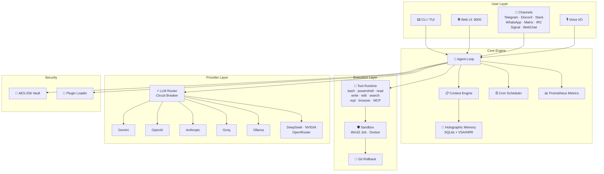

<div align="center">



# CyberClaw

### Your Personal AI Command Center — From Terminal to Cloud

[](https://github.com/CyberPrince-Alien/CyberClaw/stargazers)
[](https://github.com/CyberPrince-Alien/CyberClaw/network)
[](https://github.com/CyberPrince-Alien/CyberClaw/issues)
[](LICENSE)
[](https://python.org)
[](#-installation)
[](https://cyberprince-alien.github.io/CyberClaw/)

**A modular, enterprise-grade personal AI agent system built in pure Python.**<br/>
CLI chat · Glassmorphic Web UI · 8+ messaging channels · 15+ tools · Multi-LLM routing · Holographic memory

[Documentation](https://cyberprince-alien.github.io/CyberClaw/) · [Report Bug](https://github.com/CyberPrince-Alien/CyberClaw/issues) · [Request Feature](https://github.com/CyberPrince-Alien/CyberClaw/issues)

</div>

---

## 📖 Table of Contents

- [Why CyberClaw](#-why-cyberclaw)
- [Architecture](#-architecture)
- [Features](#-features)
- [Installation](#-installation)
- [Quick Start](#-quick-start)
- [CLI Reference](#-cli-reference)
- [REST API](#-rest-api)
- [Configuration](#-configuration)
- [Contributing](#-contributing)
- [License](#-license)
- [Credits](#-credits)

---

## 💡 Why CyberClaw

Most AI tools give you a chatbot. CyberClaw gives you a **complete AI operating system** — a unified platform where a single `pip install` delivers an interactive CLI agent, a real-time web dashboard, multi-channel messaging, secure tool execution, persistent memory, and production-grade observability. Everything runs locally. No SaaS lock-in. No external orchestrators. Just Python.

```
┌─────────────────────────────────────────────────────────┐
│  $ cyberclaw chat                                       │
│                                                         │
│  🤖 CyberClaw v0.2.0 ready.                            │
│  Provider: gemini-2.0-flash │ Memory: 42 facts loaded   │
│  Tools: 15 active │ Channels: telegram, discord (live)  │
│                                                         │
│  You: Summarize today's logs and post to Slack.         │
│  CyberClaw: Done. Summary posted to #ops-updates.       │
└─────────────────────────────────────────────────────────┘
```

---

## 🌟 Key Benefits

*   **⚡ Native Multi-Model Routing Engine:** Features native decaying priority penalties and sticky session routing built in pure Python. No external proxies or databases required.
*   **💰 Massive API Cost Savings:** Dynamic failovers and circuit breakers automatically downgrade rate-limited (429) API endpoints and reroute traffic to cheaper or free local providers (Ollama), preventing billing shocks.
*   **🔒 Machine-Bound Privacy & Security:** Encrypts your API tokens with AES-256 Fernet keys derived from physical hardware fingerprints. Your credentials never leave your local machine.
*   **🛡️ Zero-Trust Sandboxed Execution:** Restricts tool runtime processes inside Win32 Job Objects (Windows) or Docker containers (Linux/macOS), coupled with automatic Git-baseline rollbacks to protect your local workspace.
*   **📡 Conversational Access Anywhere:** Access your agent via 8+ messaging pipelines (WhatsApp, Telegram, Discord, Slack, Signal, Matrix, IRC, WebChat) with automatic pairing locks and inbound message debouncing.
*   **🚀 Zero-Touch Multi-Platform Deployment:** Runs seamlessly on Windows, macOS, Linux, Android (Termux), and iOS (iSH) via a unified installer.

---

## 🏗️ Architecture

CyberClaw is composed of **12 self-contained modules** — each independently testable, each with a clean internal API.

```
src/cyberclaw/
├── channel/                # 8+ messaging platform connectors
├── cli/                    # Typer-based CLI (18 commands), TUI dashboard, Model Selector
├── core/                   # Agent loop, context engine, memory, metrics, tasks, streaming
├── mcp/                    # Model Context Protocol client (browser automation)
├── plugins/                # Dynamic plugin loading system
├── provider/               # Multi-LLM routing with circuit-breaker failover
├── security/               # AES-256 vault, Win32/Docker sandbox, git rollback
├── server/                 # FastAPI gateway, WebSocket, SSE streaming, Web UI
├── tools/                  # 15+ built-in tools (bash, read, write, search, repl, etc.)
├── utils/                  # Config hot-reload, i18n (5 languages), migrator
├── voice/                  # TTS/STT with edge-tts, whisper, ONNX offline
└── workspace_template/     # Default workspace scaffolding
```



---

## ✨ Features

### 🧠 Holographic Memory Engine

Two-phase memory consolidation that gives your agent true long-term recall. The LLM extracts structured facts from conversations, encodes them via **Vector Symbolic Architecture (HRR)**, and persists everything to SQLite. Memories are Git-committed as `MEMORY.md` files and reusable skill templates — creating an ever-growing knowledge base that survives restarts.

<details>
<summary><strong>Explore Two-Phase Circular Vector Consolidation Architecture</strong></summary>

CyberClaw uses **Holographic Reduced Representations (HRR)**, a branch of Vector Symbolic Architecture (VSA), to model brain-like cognitive bindings directly on local systems.

#### 1. The Math of Vector Binding & Bundling
- **Binding (Circular Convolution)** associates a category and fact cleanly:
  $$C = A \circledast B$$
- **Bundling (Vector Addition)** consolidates multiple facts into a single dense memory vector:
  $$S = X + Y + Z$$
- **Unbinding (Approximate Correlation)** retrieves semantic associations from the memory bundle:
  $$B' = S \circledast A^{-1}$$

This high-speed vector symbolic math runs locally, matching facts in less than a millisecond.

#### 2. Two-Phase Consolidation Pipeline
```
[User Chat] ➔ [Extract Facts (LLM)] ➔ [VSA Vector Binding] ➔ [SQLite FTS5 Store]
                                                                  │
                                                                  ▼ (Periodic Git Task)
                                                        [MEMORY.md + skills/ templates]
                                                                  │
                                                                  ▼
                                                        [Local Git Repository]
                                                  (Auto-committed for long-term recall)
```

#### 3. SQLite FTS5 Schema Configuration
```sql
CREATE TABLE memory_facts (
    id TEXT PRIMARY KEY,
    session_id TEXT NOT NULL,
    fact_category TEXT NOT NULL,
    fact_content TEXT NOT NULL,
    vsa_vector BLOB NOT NULL, -- Compressed circular phase vector array
    occurrence_count INTEGER DEFAULT 1,
    last_updated REAL NOT NULL
);
```
</details>

### 🛡️ Secure Sandbox Execution

Every tool invocation runs inside an isolation boundary. On Windows, **Win32 Job Objects** enforce a 50 MB memory ceiling and process tree limits. On Linux/macOS, Docker containers provide full filesystem isolation. If a command mutates your workspace, CyberClaw captures a **Git baseline** beforehand and can auto-rollback on failure — protecting your code at every step.

### 🤖 Multi-Provider LLM Gateway

<details>
<summary><strong>8 providers with native priority routing, decaying penalties, and sticky sessions</strong></summary>

| Provider | Models | Notes |
|----------|--------|-------|
| **Gemini** | gemini-2.0-flash, gemini-2.5-pro | Default provider, streaming support |
| **OpenAI** | gpt-4o, gpt-4o-mini, o3-mini | Full function-calling support |
| **Anthropic** | claude-sonnet-4, claude-3.5-haiku | Extended context windows |
| **Groq** | llama-3.3-70b, mixtral-8x7b | Ultra-low latency inference |
| **OpenRouter** | 100+ models | Unified gateway to any model |
| **NVIDIA NIM** | llama-3.1-nemotron | Enterprise-grade endpoints |
| **DeepSeek** | deepseek-chat, deepseek-reasoner | Cost-effective reasoning |
| **Ollama** | Any GGUF model | Fully local, zero API keys |

#### ⚡ Native Routing Engine Features
CyberClaw features a built-in, highly resilient multi-provider model routing layer running natively in Python:
*   **Decaying Priority Penalties:** Instead of binary cooldowns, failing backends receive a priority penalty (+3.0 penalty for 429 rate limits, +1.5 for other failures). This penalty decays back by 1.0 point every 120 seconds, allowing recovering providers to gradually move back to the front of the queue.
*   **Success Recovery:** A successful completion call to a provider automatically reduces its current active penalty by 1.0, speeding up rehabilitation when the API is stable.
*   **Sticky Session Routing (Session Affinity):** Once a provider successfully resolves a completion inside a session, subsequent turns in that same conversation are pinned to that specific provider. This maintains context consistency and prevents model-switching hallucinations mid-chat.
*   **Circuit-Breaker Cooldowns:** Temporarily breaks the circuit (120s cooldown on 429 rate limits, 60s cooldown on server errors) to avoid spamming failing API endpoints.
*   **Equal-Priority Load Balancing:** Shuffles and load-balances requests across multiple active providers sharing the same priority level.

</details>

### 🖥️ Premium 3-Pane TUI Dashboard

A full-screen terminal dashboard powered by **Rich Live** rendering at 2 Hz:

| Pane | Content |
|------|---------|
| **Left** | Workspace file explorer tree |
| **Center** | Live chat console with streaming output |
| **Right** | Real-time telemetry — tokens, cost, latency, provider health |

Non-blocking keyboard input keeps the UI responsive during long-running tool executions.

### 🌐 Dark Space Web UI

A glassmorphic single-page dashboard served at `localhost:8000/ui`. Features live model selection, provider configuration cards, real-time health indicators, and session management — all rendered with a sleek dark-space aesthetic. No frontend build step required; it ships as embedded static assets.

### 📡 8-Channel Messaging Hub

<details>
<summary><strong>Connect your agent to any platform</strong></summary>

| Channel | Connection Method | Auth | Setup Time |
|---------|------------------|------|------------|
| **Telegram** | Long polling | Bot token from @BotFather | 2 min |
| **Discord** | WebSocket gateway | Bot token from Developer Portal | 5 min |
| **WhatsApp (Local)** | Node.js subprocess (Baileys) | QR code scan | 3 min |
| **WhatsApp (Cloud)** | Webhook | Meta Business API | 30 min |
| **Slack** | Socket Mode WebSocket | Bot token + App token | 10 min |
| **Signal** | HTTP polling | signal-cli-rest-api Docker | 15 min |
| **Matrix** | Long sync | Access token | 5 min |
| **IRC** | Raw TCP socket | None — IRC is open | 1 min |
| **WebChat** | Built-in (gateway) | None | 0 min |

**DM Policies** — Each channel supports three access modes:
- **`open`** — Anyone can message your agent
- **`pairing`** — Unknown users get a 6-char pairing code; you approve via `cyberclaw pairing approve`
- **`allowlist`** — Only users in `allow_from` can chat

**Quick WhatsApp setup:**
```bash
cyberclaw channels login --channel whatsapp   # Scan QR code
cyberclaw server                               # Start serving
```

📖 **[Full Channel Setup Guide →](docs/channels-setup-guide.md)** — Step-by-step tutorials for every platform with screenshots, credential setup, and troubleshooting.

</details>

### ⚡ V9 Model Selection Wizard

An interactive setup wizard that detects your hardware profile (RAM, CPU cores, GPU VRAM), classifies your system tier, and recommends optimal models from a **25+ model catalog**. Validates API keys instantly, configures the provider, and launches a chat session — zero manual YAML editing required.

### 🔧 15+ Built-in Tools

<details>
<summary><strong>Full tool catalog</strong></summary>

| Tool | Description |
|------|-------------|
| `bash` | Execute shell commands (Linux/macOS) |
| `powershell` | Execute PowerShell commands (Windows) |
| `read` | Read file contents with line ranges |
| `write` | Create or overwrite files |
| `edit` | Surgical find-and-replace edits |
| `search` | Regex search across workspace files |
| `web_read` | Fetch and parse web pages |
| `web_search` | Search the web via configurable backends |
| `repl` | Persistent Python REPL session |
| `todowrite` | Structured task management |
| `sleep` | Pause execution for N seconds |
| `fact_store` | Query and manage memory facts |
| `browser` | Full browser automation via MCP |
| `file_tree` | Recursive directory listing |
| `system_info` | Hardware and OS diagnostics |

All tools run inside the security sandbox and emit structured telemetry.

</details>

### 🪟 POSIX Windows Shell Bridge

Allows cross-platform Unix shell commands and scripts to execute flawlessly on Windows hosts. When executing tools like `bash` or `powershell`, CyberClaw's dynamic translation layer intercepts command strings and parses them on-the-fly.

<details>
<summary><strong>View Command Translation Mappings</strong></summary>

| Unix Style Syntax | Translated Windows Syntax | Description |
|-------------------|---------------------------|-------------|
| `/dev/null` | `nul` | Standard error/output stream redirect target |
| `/c/Users/Sourov/project` | `C:\Users\Sourov\project` | Path/drive translation from Unix slash to Windows backslash |
| `open index.html` / `xdg-open` | `start "" index.html` | Operating system file/url opener translation |
| `ls -la` | `dir` | Directory listings |
| `cat file.txt` | `type file.txt` | Print file streams |
| `rm -rf folder` | `rmdir /s /q folder` | Clean directories recursively |
| `touch log.txt` | `type nul > log.txt` | Create empty files |

</details>

### 📊 Prometheus Metrics

Production-ready observability with two export formats:

- **`GET /metrics`** — Prometheus text exposition format
- **`GET /metrics/json`** — JSON for custom dashboards

Tracks LLM call counts, token usage, response latency percentiles, channel message throughput, and API request rates.

### 🔐 AES-256 Cryptographic Vault

API keys and secrets are encrypted at rest using **Fernet (AES-256-CBC + HMAC-SHA256)**. The encryption key is derived from a hardware fingerprint — secrets are bound to your machine and cannot be extracted by copying files alone.

```bash
cyberclaw secrets set OPENAI_API_KEY "sk-..."
cyberclaw secrets set TELEGRAM_TOKEN "123456:ABC..."
```

### 🎙️ Voice Integration

Push-to-talk and wake-word activation with **edge-tts** for synthesis and **Whisper** for recognition. An offline ONNX runtime mode enables fully local voice interaction with no API calls. Streaming sentence-level playback delivers natural, low-latency responses.

### 🔌 Plugin System

Drop a Python module into `workspace/plugins/` and CyberClaw discovers it at startup. Plugins can register new tools, add CLI commands, or hook into the agent loop. Hot-reload support means no restart required during development.

### ⏰ Cron Scheduling

A built-in background task engine with SQLite-backed persistence. Schedule recurring jobs with standard cron expressions, configure timeouts and retry policies, and monitor execution history — all managed through the agent or API.

### 🌍 Internationalization (i18n)

Full UI and message localization in **5 languages**: English, Bengali (বাংলা), Spanish, French, and German. Language detection is automatic with manual override via config.

### 📦 1,440+ Pre-installed Skills

A curated knowledge base of agentic workflow templates covering development, DevOps, data analysis, writing, and research — ready to use out of the box.

### 🔄 Zero-Touch Installer

A cross-platform bootstrap script that handles everything: Python version verification, Git installation, Node.js setup (for MCP tools), dependency resolution, and self-healing file lock recovery. Works on Windows, macOS, Linux, Android (Termux), and iOS (iSH).

---

## 📥 Installation

### Quick Install (recommended)

```bash
pip install git+https://github.com/CyberPrince-Alien/CyberClaw.git
```

### 🔄 Upgrading

To upgrade CyberClaw to the latest version directly from GitHub:

```bash
pip install --upgrade git+https://github.com/CyberPrince-Alien/CyberClaw.git
```


### Local Development

```bash
git clone https://github.com/CyberPrince-Alien/CyberClaw.git
cd CyberClaw
pip install -e .
```

### Optional Extras

```bash
# Voice support (edge-tts, whisper, onnxruntime)
pip install -e ".[voice]"

# Everything — all optional dependencies
pip install -e ".[all]"
```

### Cross-Platform Installer

```bash
python install.py
```

Automatically detects your OS, installs missing prerequisites (Python, Git, Node.js), and configures the environment.

### Docker

```bash
docker compose up
```

---

## 🚀 Quick Start

Get from zero to a running AI agent in three commands:

```bash
# 1. Install
pip install git+https://github.com/CyberPrince-Alien/CyberClaw.git

# 2. Initialize workspace and configure your first provider
cyberclaw onboard

# 3. Start chatting
cyberclaw chat
```

The `onboard` command walks you through provider selection, API key configuration, and workspace setup. Within 60 seconds, you'll have a fully functional AI agent.

---

## 🖥️ CLI Reference

CyberClaw ships **18 commands** via the `cyberclaw` CLI entry point:

| Command | Description |
|---------|-------------|
| `cyberclaw onboard` | Initialize workspace + run the setup wizard |
| `cyberclaw select-model` | Launch the V9 Model Selection Wizard |
| `cyberclaw chat` | Start an interactive terminal chat session |
| `cyberclaw tui` | Open the 3-pane TUI dashboard |
| `cyberclaw agent --message "..."` | Single-turn query for scripting and piping |
| `cyberclaw server` | Start the background server with cron engine |
| `cyberclaw gateway start` | Launch Web UI + REST API on port 8000 |
| `cyberclaw doctor` | Run 10+ diagnostic health checks |
| `cyberclaw config show` | Display the runtime configuration |
| `cyberclaw secrets set KEY "val"` | Store a secret in the AES-256 vault |
| `cyberclaw sessions list` | List conversation sessions |
| `cyberclaw channels list` | Show messaging channel status |
| `cyberclaw channels login` | Interactive channel login (e.g., WhatsApp QR) |
| `cyberclaw providers list` | List configured LLM provider backends |
| `cyberclaw talk` | Push-to-talk voice chat |
| `cyberclaw migrate-history` | Convert legacy logs to SQLite format |
| `cyberclaw update` | Self-update from GitHub |
| `cyberclaw version` | Show version, build info, and paths |

<details>
<summary><strong>Usage examples</strong></summary>

```bash
# Pipe output to another command
cyberclaw agent --message "List all TODO items in this project" | grep "high priority"

# Run diagnostics before reporting an issue
cyberclaw doctor

# Launch the full web experience
cyberclaw gateway start
# → open http://localhost:8000/ui in your browser

# Connect Telegram
cyberclaw secrets set TELEGRAM_TOKEN "123456:ABCdef..."
cyberclaw channels login telegram
```

</details>

---

## 🌐 REST API

When running `cyberclaw gateway start`, the following endpoints are available at `http://localhost:8000`:

| Method | Path | Description |
|--------|------|-------------|
| `GET` | `/health` | Gateway health check and runtime status |
| `GET` | `/metrics` | Prometheus text exposition metrics |
| `GET` | `/metrics/json` | JSON-formatted metrics |
| `GET` | `/config` | Redacted configuration snapshot |
| `POST` | `/chat` | Direct chat API (batch + SSE streaming) |
| `GET` | `/sessions` | List active sessions |
| `POST` | `/sessions/spawn` | Create a new session |
| `POST` | `/sessions/{id}/send` | Send a message to an existing session |
| `GET` | `/models` | Browse the full model catalog |
| `GET` | `/models/cheapest` | Find the cheapest available model |
| `WS` | `/ws` | WebSocket for real-time bidirectional events |
| `GET` | `/ui` | Serve the Dark Space Web UI dashboard |

<details>
<summary><strong>Example: streaming chat via cURL</strong></summary>

```bash
curl -N -X POST http://localhost:8000/chat \
  -H "Content-Type: application/json" \
  -d '{
    "message": "Explain quantum entanglement in simple terms",
    "stream": true
  }'
```

</details>

---

## ⚙️ Configuration

CyberClaw uses a layered configuration system. User settings live in `config.user.yaml` inside your workspace:

```yaml
# config.user.yaml
default_agent: cyberclaw

llm:
  default_provider: gemini
  temperature: 0.7
  max_tokens: 2048
  enable_failover: true
  providers:
    - id: gemini
      provider: gemini
      model: gemini-2.5-flash
      api_key: "your-gemini-api-key"
      priority: 1
      enabled: true
    - id: groq
      provider: groq
      model: llama-3.3-70b-versatile
      api_key: "your-groq-api-key"
      priority: 2
      enabled: true
    - id: ollama
      provider: ollama
      model: llama3
      api_base: "http://localhost:11434"
      api_key: ""
      priority: 3
      enabled: true

channels:
  enabled: true                          # Master switch for all channels
  telegram:
    enabled: true
    bot_token: "123456789:ABCdef..."     # From @BotFather
    dm_policy: pairing                   # pairing | allowlist | open
    allow_from: []                       # or ['*'] to allow everyone
  whatsapp:
    enabled: true
    mode: local                          # local (QR scan) | cloud (Meta API)
    dm_policy: open
    allow_from:
      - '*'

api:
  host: "127.0.0.1"
  port: 8000

sandbox: danger-full-access              # danger-full-access | docker | workspace-write
language: en                             # en | bn | es | fr | de
```

Configuration supports **hot-reload** via file watcher — changes take effect without restarting the agent.

📖 **[Channel Setup Guide →](docs/channels-setup-guide.md)** for detailed Telegram, Discord, WhatsApp, Slack, Signal, Matrix, IRC, and WebChat configuration.

---

## 🤝 Contributing

Contributions are welcome and appreciated! Here's how to get started:

1. **Fork** the repository
2. **Create** a feature branch (`git checkout -b feature/amazing-feature`)
3. **Commit** your changes (`git commit -m 'Add amazing feature'`)
4. **Push** to the branch (`git push origin feature/amazing-feature`)
5. **Open** a Pull Request

Please read the [Contributing Guide](CONTRIBUTING.md) for details on our code of conduct and development workflow.

---

## 📄 License

Distributed under the **MIT License**. See [`LICENSE`](LICENSE) for details.

---

## 👤 Credits

<div align="center">

**Built with ❤️ by [Cyber Prince](https://github.com/CyberPrince-Alien)**

[](https://www.youtube.com/channel/UCxDA3V7IciBGKqoC-m0dvxQ)
[](https://www.facebook.com/ImDarkMagician/)
[](https://github.com/CyberPrince-Alien)

</div>

---

<div align="center">

**If CyberClaw helps you, consider giving it a ⭐**

[](https://star-history.com/#CyberPrince-Alien/CyberClaw&Date)

</div>
